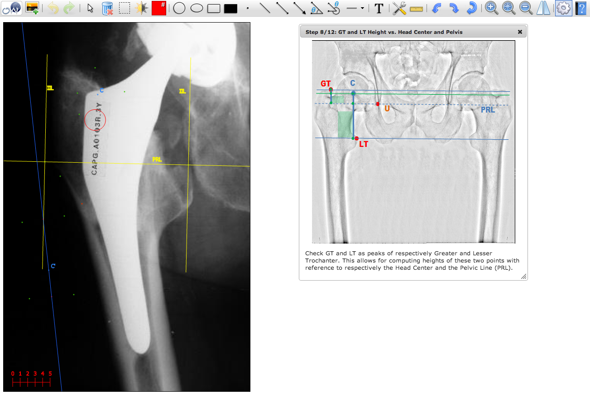
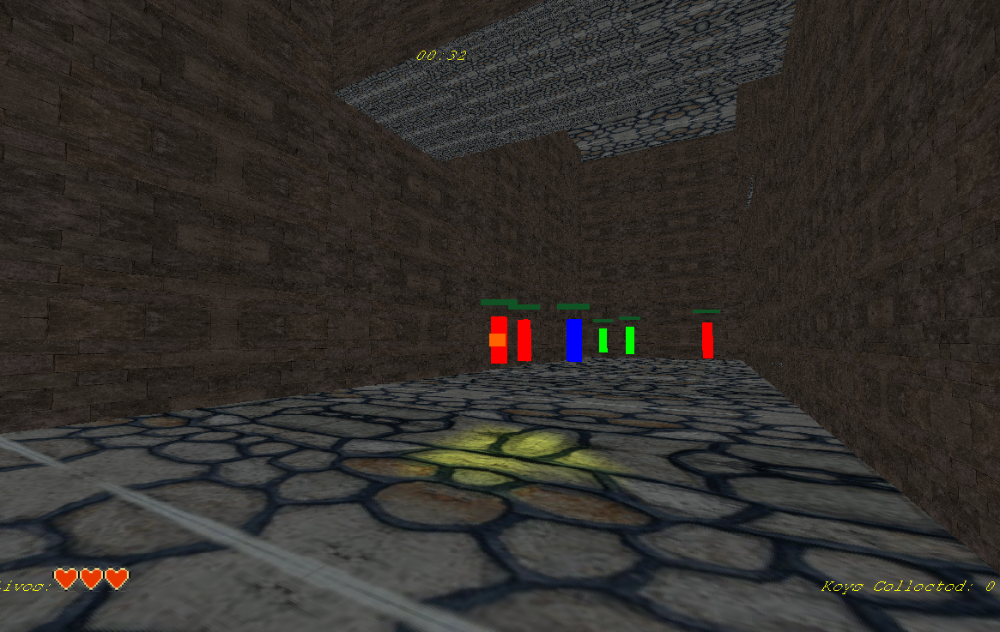
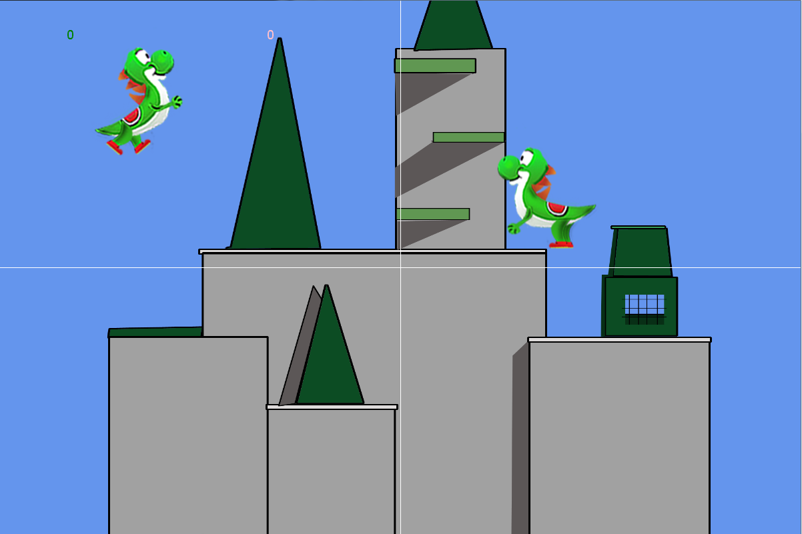
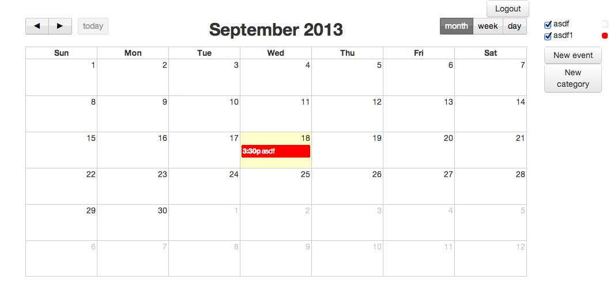

Pictin
--

Context: Work 
Team size: 2 

Pictin is an application used to generate many kinds of measurements pertaining to the analysis of human body X-rays. It
offers functionalities such as rotation, scale, zoom, measurement of angles and distances, as well as the drawing of
primitive shapes. Furthermore, it has an undo/redo function for instances where an error was made. Finally, the application 
contains several step-by-step processes designed to guide the user in the measurement of values specific to certain parts of the body.

My contribution:

- All tools except the contrast and brightness functions
- Undo/Redo
- All step-by-step processes

Experience gained:

- Linear algebra
- Interface and application state management
- Javascript

I unfortunately cannot give public access to the code, but am more than happy to demo the application to any potential 
employer.

Hospital-visits
--

Context: School 
Team size: 1 

This application is used to calculate the number of collisions between patient visits in an hospital. The constraints
for a collision are arbitrarily defined by the user. The focus of the project was mainly put on the performance and 
scaling of the algorithm, which forced me to consider its memory footprint as well as its computational efficiency. 

Experience gained:

- Model-View-Controller architecture
- Performance based requirements; optimization of an algorithm used to generate visit-combinations permutations
- Design patterns : Observer, Facade, Bridge
- Unit testing
- C#; .NET

https://github.com/Bobbybobbets/Cheo-visits  

StoreSimulation
--

Context: School 
Team size: 1 

This is a grocery store simulation that models the flow of customers according to different parameters, such as the number
of items bought and the time of arrival. The project's focus was on design patterns as well as flexibility through proper
abstraction. Furthermore, traceability between requirements, design, and code was strongly enforced. 

Experience gained:

- Model-View-Controller architecture
- Design patterns : Strategy, Facade, Observer, Singleton, Bridge
- C#; .NET

https://github.com/Bobbybobbets/StoreSimulation  

Jade Monkey
--

Context: School 
Team size: 2

Jade Monkey is a 3D first-person shooter game in which the goal is to find the missing pieces of a key in
order to open a door. While doing this, you must also fight monsters by shooting fireballs at them as well as dodging their projectiles. There are currently 3 classes of monsters :
melee, range, and healer. They each have different skills, from fireballs to healing orbs, and react in different ways depending on their current state
relative to other entities. For example, healers will seek allies with the least health and monsters will run away from the player when close to death. 

My contribution:

- Code architecture and design
- Lighting, textures, health bars
- Monster behaviour(AI), pathfinding

Experience gained:

- System-Entity-Component architecture
- Artificial intelligence
- Pathfinding in 3D
- Linear algebra
- C++
- Direct3D
- 3D programming
- Design patterns: Singleton, Factory, Strategy, Bridge

https://github.com/Bobbybobbets/JadeMonkey  

SSB-Clone
--

Context: School 
Team size: 2 

Clone of the popular game Super Smash Brothers.  

My contribution:

- Code architecture and design
- Computer artificial intelligence, pathfinding
- 2D collision detection and collision response
- Character action system
- Character movement

Experience gained:

- System-Entity-Component architecture(continued)
- Artificial intelligence(continued)
- Pathfinding in 2D
- Collision detection in 2D
- Linear algebra
- C#; .NET; XNA
- Design patterns: Singleton, Factory, Strategy, Bridge

https://github.com/Bobbybobbets/SSB-clone  

CalendarCrud
--

Context: School 
Team size: 1 

Small javascript/nodejs calendar application. The user can add, remove and modify events from the calendar. This project's main goal was to get me acquainted with the latest web technologies
as well as the latest workflow enhancing techniques. 

Experience gained:

- Model-View-Controller architecture
- REST interfaces
- NodeJS; ExpressJS; AngularJS
- Object Relational Mapping (ORM)
- Design patterns: Facade, Dependency injection
- Command line tools: Yeoman, Grunt, Bower, NPM

https://github.com/Bobbybobbets/CalendarCrud  
